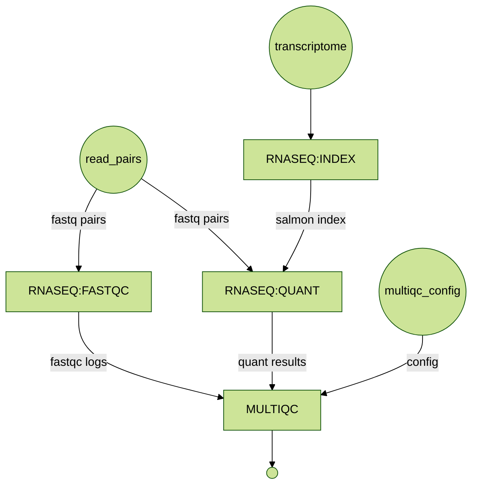

# RNAseq-Demo

A Nextflow DSL2 pipeline for paired-end RNA-seq quantification using Salmon, with FastQC and MultiQC reporting.

[](https://github.com/FrederickMappin/rnaseq-nf)
[](https://nextflow.io)
[](https://docker.com)

## What this pipeline does



The workflow runs four steps:

1. **INDEX**: builds a Salmon index from the provided transcriptome FASTA
2. **FASTQC**: runs FastQC on each paired-end sample
3. **QUANT**: quantifies transcript expression with `salmon quant`
4. **MULTIQC**: aggregates FastQC and Salmon outputs into a single HTML report

Parameter validation and samplesheet parsing is handled by `nf-schema`. Provenance is captured automatically via `nf-prov` (BCO format).

## Requirements

- Java 11+
- Nextflow ≥ 25.10.4
- Docker

Install Nextflow:

```bash
curl -s https://get.nextflow.io | bash
```

## Profiles

All parameters are pre-configured per profile — no extra arguments required for standard runs.

| Profile | Executor | Container | Data location |
|---|---|---|---|
| `local_test` | local | `rnaseq-nf:1.4.0` | local project paths |
| `batch_test` | AWS Batch | ECR (`rnaseq-nf:v1.1`) | S3 |

### local_test

Runs locally using Docker with data from the `data/` directory.

```bash
nextflow run main.nf -profile local_test
```

### batch_test

Runs on AWS Batch with inputs and outputs on S3.

```bash
nextflow run main.nf -profile batch_test
```

> The `workDir` for batch is scoped outside the data lake zones (`nextflow/work/{sessionId}/`) to keep scratch files separate from curated outputs.

## Overriding parameters

All profile defaults can be overridden at the command line:

```bash
# Local run with a custom samplesheet
nextflow run main.nf -profile local_test \
    --input path/to/my_samplesheet.csv

# Batch run with a custom transcriptome
nextflow run main.nf -profile batch_test \
    --transcriptome s3://my-bucket/refs/transcriptome.fa
```

## Input format

The `--input` CSV must contain these columns:

```csv
sample_id,project_id,fastq_1,fastq_2
0001,Project_20260220_SEQ001,data/.../ggal_gut_1.fq,data/.../ggal_gut_2.fq
```

| Column | Description |
|---|---|
| `sample_id` | Sample identifier |
| `project_id` | Groups all outputs under a single project folder |
| `fastq_1` | Path to R1 FASTQ (`.fq`, `.fastq`, or `.gz`) |
| `fastq_2` | Path to R2 FASTQ |

## Output layout

All outputs are written to `--outdir/{project_id}/`:

```text
<outdir>/<project_id>/
├── <sample_id>/
│   ├── fastqc/                        FastQC reports
│   └── quant/                         Salmon quantification
├── multiqc/
│   └── multiqc_report.html            Aggregated QC report
├── report.html                        Nextflow execution report
├── pipeline_provenance.bco.json       BCO provenance record
└── .nextflow.log                      Pipeline run log
```

## Parameters

| Parameter | Description | Default |
|---|---|---|
| `--input` | Samplesheet CSV path | set by profile |
| `--transcriptome` | Transcriptome FASTA path | set by profile |
| `--outdir` | Output directory (local or S3) | set by profile |
| `--multiqc` | MultiQC config directory | set by profile |
| `--help` | Print usage help | `false` |

## Software

| Tool | Version | Purpose |
|---|---|---|
| [Salmon](https://combine-lab.github.io/salmon/) | 1.10.3 | Transcript quantification |
| [FastQC](https://www.bioinformatics.babraham.ac.uk/projects/fastqc/) | 0.12.1 | Read quality control |
| [MultiQC](https://multiqc.info) | 1.25 | QC report aggregation |
